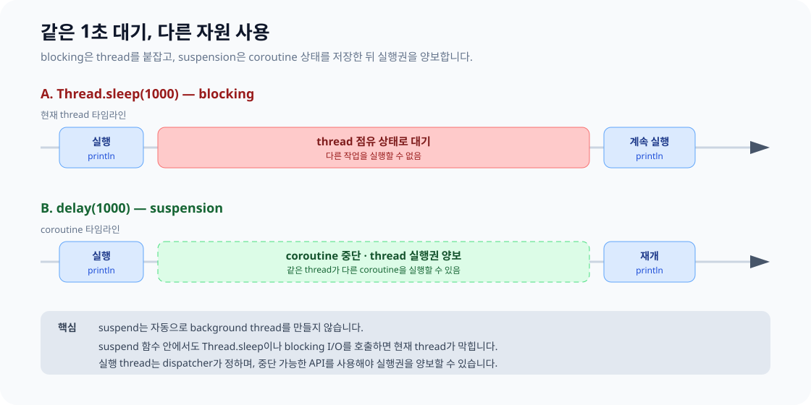
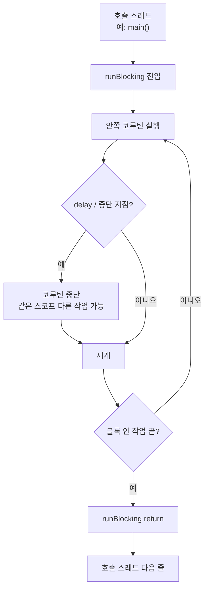
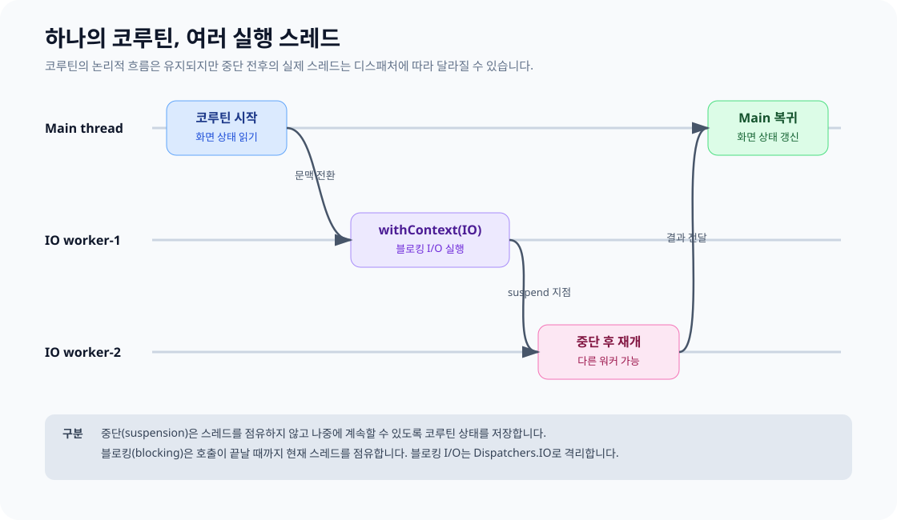

# 코루틴 기초

코루틴은 **중단 가능한 계산**입니다.  
이 문서는 `suspend`와 `runBlocking`을 중심으로, **중단(suspension)** 과 **블로킹(blocking)** 차이를 예제·그림으로 정리합니다.

> `launch`, `async`, `delay`, `Flow`, `runBlocking`은 Kotlin 표준 라이브러리가 아니라 **`kotlinx-coroutines`** 가 필요합니다.

## 목차

1. [핵심 용어](#핵심-용어)
2. [`suspend`가 의미하는 것](#suspend가-의미하는-것)
3. [`runBlocking`: 바깥은 block, 안은 suspend](#runblocking-바깥은-block-안은-suspend)
4. [구조화된 동시성](#구조화된-동시성)
5. [스레드·Dispatcher와의 관계](#스레드dispatcher와의-관계)
6. [한눈에 복습](#한눈에-복습)

---

## 핵심 용어

| 개념 | 의미 |
|---|---|
| `suspend` | 코루틴 문맥에서 **중단·재개** 가능한 함수 표시 |
| `runBlocking` | 호출 스레드를 **블록**하며 코루틴 세계를 여는 다리 |
| `CoroutineScope` | 코루틴 생명주기를 묶는 범위 |
| `launch` | 결과 없는 작업 시작 → `Job` |
| `async` | 결과 있는 작업 시작 → `Deferred<T>` |
| `withContext` | 지정 dispatcher에서 실행 후 결과 반환 |
| `Flow<T>` | 비동기로 여러 값을 방출하는 스트림 |

```kotlin
suspend fun loadUser(): User {
    delay(100)
    return User("Kotlin")
}
```

---

## `suspend`가 의미하는 것

**한 줄:** 이 함수는 중간에 책갈피를 꽂고 나갔다가, 나중에 같은 자리에서 이어서 실행될 수 있다.  
**아님:** 새 스레드에서 실행한다 / 자동으로 백그라운드로 보낸다.

### 왜 필요한가

| 방식 | 동작 |
|---|---|
| 일반 함수 + `Thread.sleep` / 블로킹 I/O | **스레드 전체**를 점유한 채 대기 |
| `suspend` + `delay` / 중단 가능 API | **코루틴만** 멈추고 스레드는 양보 가능 |



비유: 웨이터(스레드)가 주방을 테이블 앞에서 막지 않고, “나오면 불러주세요” 후 다른 테이블을 보다가 돌아온다.

### 예제: 중단과 재개

```kotlin
suspend fun loadUser(): User {
    println("1. 요청 시작")
    delay(1000)               // 중단 지점
    println("2. 1초 후 재개")
    return User("Kotlin")
}
```

```text
println("1…")
    → delay: 코루틴 상태 저장 후 중단 (스레드 양보 가능)
    → (시간 경과)
    → 재개: println("2…") → return
```

### 호출 규칙

`suspend`는 **코루틴 문맥**에서만 호출할 수 있습니다.

```kotlin
fun main() {
    // loadUser()  // ❌ 중단·재개 문맥 없음
}

fun main() = runBlocking {
    println(loadUser())  // ✅
}

suspend fun loadScreen(): Screen {
    val user = loadUser()    // ✅ 다른 suspend 안
    val posts = loadPosts()
    return Screen(user, posts)
}
```

### 오해와 반례

| 오해 | 실제 |
|---|---|
| `suspend` = 백그라운드 스레드 | 스레드는 `Dispatchers`가 정함 |
| `suspend`만 붙이면 non-blocking | 안쪽 `Thread.sleep`은 여전히 블로킹 |
| `suspend` = 병렬 | 대기를 순차 코드처럼 쓰는 것. 병렬은 `async` 등 |

```kotlin
suspend fun badWait() {
    Thread.sleep(1000)  // 스레드 점유 — delay가 아님
}

suspend fun goodWait() {
    delay(1000)         // 코루틴만 중단
}
```

---

## `runBlocking`: 바깥은 block, 안은 suspend

**한 줄:** 호출한 스레드를 블록이 끝날 때까지 막고, 그 안에서 코루틴을 돌리는 다리.  
`main()`에서 쓰면 **메인 스레드는** `runBlocking`이 끝날 때까지 다음 줄로 가지 못한다.


### 예제

```kotlin
fun main() {
    println("before: ${Thread.currentThread().name}")

    runBlocking {
        println("inside start")
        delay(1000)  // 코루틴만 중단
        println("inside after delay")
    }

    // runBlocking 끝나기 전엔 도달 불가
    println("after: ${Thread.currentThread().name}")
}
```

```text
before: main
inside start
(1초 — main은 여전히 runBlocking에서 대기)
inside after delay
after: main
```

### 두 관점

| 관점 | 동작 |
|---|---|
| 바깥 (호출 스레드) | 완료까지 **블로킹** → 진행 불가 |
| 안쪽 코루틴 | `delay` 시 **코루틴만** 중단 |
| 같은 블록의 다른 코루틴 | 하나가 중단돼도 다른 작업 실행 가능 |

```kotlin
fun main() = runBlocking {
    launch {
        delay(500)
        println("A")
    }
    launch {
        delay(100)
        println("B")
    }
    println("setup done")
}
// 가능 출력: setup done → B → A
// main은 전체가 끝날 때까지 runBlocking에 머무름
```

### 언제 쓰고 / 피할까

| 권장 | 비권장 |
|---|---|
| 간단한 `main` 진입 | Android **UI 메인** (화면 정지) |
| 테스트에서 suspend 호출 | 프로덕션 요청 경로에 남발 |
| 블로킹 ↔ 코루틴 짧은 경계 | “백그라운드 API”로 오해하고 사용 |



---

## 구조화된 동시성

```kotlin
suspend fun loadPage(): Page = coroutineScope {
    val user = async { loadUser() }
    val posts = async { loadPosts() }
    Page(user.await(), posts.await())
}
```

부모는 자식 완료를 기다리고, 취소·실패는 계층으로 전파됩니다. 장수하는 전역 스코프보다 **소유자 생명주기**에 연결합니다.

---

## 스레드·Dispatcher와의 관계

코루틴 ≠ 스레드 1:1. 여러 코루틴이 한 스레드를 나눠 쓰거나, 한 코루틴이 중단 후 다른 스레드에서 재개될 수 있습니다.



| API | 효과 |
|---|---|
| `delay` | 코루틴 중단, 스레드 양보 |
| `Thread.sleep` | 현재 스레드 점유 |
| `withContext(Dispatchers.IO)` | 블로킹 I/O를 Main/CPU 스레드에서 분리 |

캐치: `suspend` 안에서도 블로킹 호출은 스레드를 막습니다. CPU / 블로킹 I/O / 중단 가능 I/O를 구분하세요.

---

## 한눈에 복습

| 키워드 | 호출 스레드를 막나? | 한 줄 |
|---|---|---|
| `Thread.sleep` | **예** | 점유하며 대기 |
| `delay` | 코루틴만 중단 | 스레드 양보 가능 |
| `suspend fun` | 자체로는 생성·전환 안 함 | 중단 가능 표시 |
| `runBlocking` | **예** (호출 스레드) | main/테스트용 다리 |

### 이어서 읽기

- [코루틴 심화](./13_COROUTINES_ADVANCED.md) — Dispatcher, 취소, 실패 전파
- [JVM 스레드와 동시성](./12_THREADS_CONCURRENCY.md) — Thread / join / 공유 상태
- [코루틴과 JVM 메모리](../jvm_memory_learning/docs/07_COROUTINES_AND_MEMORY.md) — continuation, StackOverflow, 누수

공식: [Coroutines basics](https://kotlinlang.org/docs/coroutines-basics.html) · [Coroutines guide](https://kotlinlang.org/docs/coroutines-guide.html)
