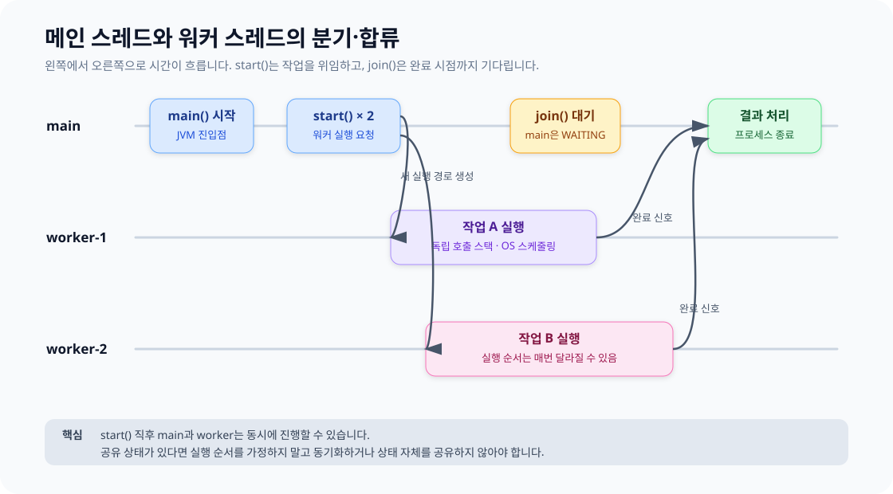
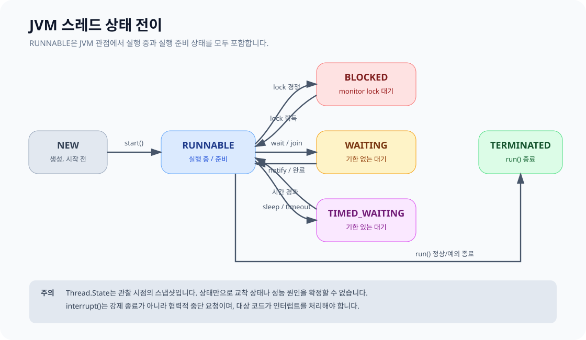

# JVM 스레드와 동시성 심화

Kotlin/JVM의 `Thread`는 JVM 스레드이며 일반적으로 운영체제 스레드에 대응합니다. 각 스레드는 독립적인 호출 스택을 가지지만 힙의 객체는 다른 스레드와 공유할 수 있습니다. 동시성 문제는 대부분 이 **공유되는 변경 가능 상태**에서 시작합니다.

## main 스레드와 worker 스레드

JVM은 프로그램 진입점인 `main`을 main 스레드에서 실행합니다. `Thread.start()`를 호출하면 새 스레드가 `run` 블록을 실행할 수 있게 되고, 호출한 main 스레드도 다음 코드를 계속 실행합니다. 정확한 실행 순서는 스케줄러가 결정합니다.



흔히 “sub thread” 또는 “자식 스레드”라고 부르지만 JVM `Thread`에는 코루틴의 `Job`처럼 부모-자식 생명주기가 자동으로 연결되는 구조가 없습니다. main에서 만든 worker도 독립적으로 실행되며, non-daemon worker가 살아 있으면 main 함수가 끝나도 JVM 프로세스가 계속될 수 있습니다. 완료 대기와 종료 요청은 코드에서 명시적으로 관리합니다.

```kotlin
fun main() {
    val worker1 = Thread({
        println("A: ${Thread.currentThread().name}")
    }, "worker-1")

    val worker2 = Thread({
        println("B: ${Thread.currentThread().name}")
    }, "worker-2")

    worker1.start()
    worker2.start()

    // 두 작업이 끝난 뒤에만 아래로 진행한다.
    worker1.join()
    worker2.join()
    println("done: ${Thread.currentThread().name}")
}
```

`run()`을 직접 호출하면 새 스레드가 생기지 않고 현재 스레드에서 평범한 함수처럼 실행됩니다. 새 실행 경로가 필요하면 반드시 `start()`를 호출합니다.

## 스레드 생명주기



| 상태 | 의미 | 대표 원인 |
|---|---|---|
| `NEW` | 생성했지만 시작하지 않음 | `Thread(...)` 직후 |
| `RUNNABLE` | JVM에서 실행 중이거나 실행 가능한 상태 | `start()` 이후 |
| `BLOCKED` | `synchronized` monitor lock 획득 대기 | 다른 스레드가 임계 구역 사용 중 |
| `WAITING` | 시간 제한 없이 다른 동작 대기 | `join()`, `wait()` |
| `TIMED_WAITING` | 정해진 시간까지 대기 | `sleep()`, 시간 제한 `join()` |
| `TERMINATED` | `run()`이 정상 또는 예외로 종료됨 | 다시 `start()`할 수 없음 |

`interrupt()`는 스레드를 즉시 죽이는 명령이 아니라 **중단 요청**입니다. `sleep`, `join`, `wait` 중이면 `InterruptedException`이 발생하고, 계산 루프라면 코드가 인터럽트 플래그를 확인해야 합니다.

```kotlin
val worker = Thread {
    while (!Thread.currentThread().isInterrupted) {
        doOneUnitOfWork()
    }
}

worker.start()
worker.interrupt()
worker.join()
```

## 동시성, 병렬성, 비동기

| 용어 | 핵심 질문 |
|---|---|
| 동시성(concurrency) | 여러 작업의 진행 구간이 겹치는가? |
| 병렬성(parallelism) | 여러 작업이 실제로 같은 순간에 실행되는가? |
| 비동기(asynchrony) | 결과를 기다리는 동안 호출 흐름을 점유하지 않는가? |

단일 코어에서도 작업을 번갈아 실행하면 동시성은 만들 수 있지만 병렬 실행은 아닙니다. 반대로 스레드를 여러 개 만들었다고 CPU 작업이 항상 빨라지는 것도 아닙니다. 코어 수, 작업 크기, 문맥 전환 비용을 함께 고려해야 합니다.

## 공유 상태와 메모리 가시성

다음 코드는 `counter++`가 읽기 → 증가 → 쓰기의 복합 연산이라 안전하지 않습니다. 두 스레드가 같은 값을 읽고 각각 덮어쓰면 증가 결과가 유실됩니다.

```kotlin
var counter = 0

val workers = List(2) {
    Thread { repeat(100_000) { counter++ } }
}
workers.forEach(Thread::start)
workers.forEach(Thread::join)

println(counter) // 항상 200_000이라고 보장할 수 없음
```

`@Volatile`은 최신 쓰기를 다른 스레드가 볼 수 있게 하는 **가시성**을 제공하지만, `counter++` 전체를 원자적으로 만들지는 않습니다.

### 상태 보호 방법

| 방법 | 적합한 경우 | 주의점 |
|---|---|---|
| 불변 값·메시지 전달 | 공유 변경을 없앨 수 있음 | 가장 먼저 검토 |
| `synchronized` / `Lock` | 여러 값을 하나의 규칙으로 변경 | 임계 구역을 짧게 유지 |
| `AtomicInteger` 등 | 카운터·플래그 같은 단일 원자 연산 | 여러 상태의 불변식에는 부족 |
| 스레드 한정 | 특정 스레드만 상태를 소유 | 다른 스레드의 직접 접근 금지 |
| 동시성 컬렉션 | 큐·맵 등 표준 패턴 | 복합 연산은 별도 원자성 확인 |

```kotlin
import java.util.concurrent.atomic.AtomicInteger

val counter = AtomicInteger(0)
val workers = List(2) {
    Thread { repeat(100_000) { counter.incrementAndGet() } }
}
workers.forEach(Thread::start)
workers.forEach(Thread::join)

check(counter.get() == 200_000)
```

`synchronized`를 사용할 때는 상태를 검사하고 변경하는 전체 단위를 같은 lock으로 보호해야 합니다.

```kotlin
class Inventory(private var stock: Int) {
    @Synchronized
    fun take(amount: Int): Boolean {
        if (stock < amount) return false
        stock -= amount
        return true
    }
}
```

## 직접 생성보다 스레드 풀

짧은 작업마다 스레드를 만들면 생성 비용과 자원 사용량을 제어하기 어렵습니다. JVM에서는 `ExecutorService`로 작업과 실행 자원을 분리합니다.

```kotlin
import java.util.concurrent.Executors

val executor = Executors.newFixedThreadPool(4)
try {
    val futures = (1..8).map { value ->
        executor.submit<Int> { value * value }
    }
    println(futures.map { it.get() })
} finally {
    executor.shutdown()
}
```

- CPU 중심 작업: 대체로 코어 수에 가까운 제한된 풀에서 시작해 측정합니다.
- 블로킹 I/O: 기다리는 시간이 길어 더 많은 스레드가 필요할 수 있지만 반드시 상한을 둡니다.
- 제출 속도가 처리 속도보다 빠르면 queue가 커지므로 용량과 거절 정책도 설계합니다.
- `Future.get()`은 현재 스레드를 블로킹합니다. 대규모 비동기 조합에는 코루틴 같은 상위 추상화를 검토합니다.

## 교착 상태를 피하는 기준

두 스레드가 서로 가진 lock을 기다리면 교착 상태가 됩니다.

1. 여러 lock이 필요하면 항상 같은 순서로 획득합니다.
2. 외부 호출이나 오래 걸리는 작업을 lock 안에서 실행하지 않습니다.
3. 중첩 lock을 줄이고 가능하면 하나의 소유자가 상태를 관리하게 합니다.
4. 시간 제한이 있는 lock과 진단용 thread dump를 운영 전략에 포함합니다.

## 선택 가이드

| 요구 | 우선 검토 |
|---|---|
| JVM 블로킹 라이브러리와 직접 통합 | 제한된 `ExecutorService` 또는 `Dispatchers.IO` |
| CPU 계산을 병렬화 | 크기가 제한된 pool 또는 `Dispatchers.Default` |
| 많은 I/O 작업을 조합·취소 | 구조화된 코루틴 |
| 단순 공유 카운터 | atomic 타입 |
| 여러 필드의 일관된 변경 | lock, 단일 소유자, 불변 상태 교체 |

캐치 포인트: “여러 스레드니까 빠르다”가 아니라 작업 종류, 공유 상태, 취소, 종료 정책까지 한 묶음으로 설계합니다.

다음 학습: [코루틴 심화](./13_COROUTINES_ADVANCED.md)

공식 참고: [Java Thread](https://docs.oracle.com/en/java/javase/17/docs/api/java.base/java/lang/Thread.html), [Thread.State](https://docs.oracle.com/en/java/javase/17/docs/api/java.base/java/lang/Thread.State.html), [Java concurrency](https://docs.oracle.com/javase/tutorial/essential/concurrency/)
