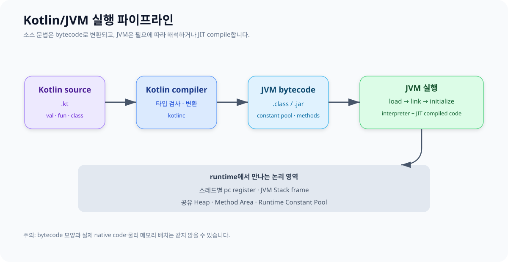

# 01. Kotlin 코드에서 JVM 실행까지

Kotlin/JVM 코드는 JVM이 Kotlin 문법을 직접 해석하는 방식으로 실행되지 않습니다. Kotlin compiler가 `.kt`를 JVM bytecode가 든 `.class`로 만들고, JVM이 class loading·linking·initialization을 거쳐 bytecode를 해석하거나 JIT compile하여 실행합니다.



## 문법이 바뀌는 예

```kotlin
data class User(val name: String)

fun greeting(user: User): String = "Hello, ${user.name}"

fun main() {
    val user = User("Kotlin")
    println(greeting(user))
}
```

컴파일 결과에는 개념적으로 다음 요소가 생깁니다.

- `User` class와 constructor, getter, `equals`, `hashCode`, `toString`, `copy`, `component1`
- 파일 최상위 함수가 들어가는 `...Kt` class의 static method
- 문자열 템플릿을 조립하기 위한 bytecode
- 호출할 method와 타입 등을 가리키는 constant pool 항목

Kotlin 문법 한 줄과 bytecode 명령 한 개가 항상 1:1로 대응하지는 않습니다. compiler version과 최적화에 따라 결과도 달라질 수 있습니다.

## 직접 관찰하기

```bash
kotlinc MemorySample.kt -include-runtime -d memory-sample.jar
jar tf memory-sample.jar
javap -c -p -classpath memory-sample.jar MemorySampleKt
```

`javap -c`에서 자주 보게 되는 명령은 다음과 같습니다.

| bytecode 계열 | 역할 |
|---|---|
| `iload`, `aload` | frame의 local variable에서 primitive 또는 참조 읽기 |
| `istore`, `astore` | local variable에 값 또는 참조 저장 |
| `new` | 새 객체를 위한 메모리 할당 요청 |
| `getfield`, `putfield` | 객체 field 읽기·쓰기 |
| `invoke*` | method 호출, 새 frame 생성으로 이어짐 |
| `ireturn`, `areturn`, `return` | 값 또는 참조 반환, 현재 frame 종료 |

## compile time과 runtime 구분

| 시점 | 대표 작업 |
|---|---|
| compile time | 타입 검사, null safety 검사, bytecode 생성 |
| class loading | class byte 읽기, `Class`와 관련 구조 준비 |
| linking | 검증, static field 준비, symbol reference 해석 |
| initialization | companion/object/static 초기화 코드 실행 |
| execution | frame 생성, 객체 할당, method 실행, GC |
| JIT optimization | 자주 실행되는 경로를 native code로 compile·최적화 |

캐치 포인트: `val user = User(...)`를 “Stack에 User 저장”이라고 설명하면 참조와 객체를 섞은 것입니다. 먼저 지역 변수 slot과 Heap 객체를 분리해서 그립니다.

다음: [JVM 런타임 메모리 영역](./02_RUNTIME_DATA_AREAS.md)
