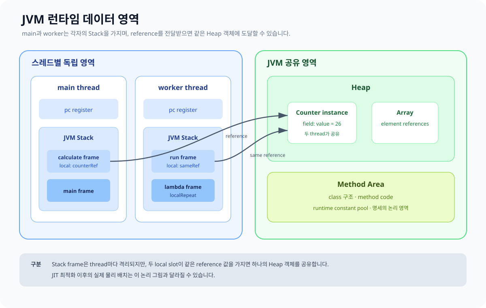

# 02. JVM 런타임 메모리 영역

JVM 명세는 실행 중 필요한 논리적 데이터 영역을 정의합니다. 일부는 JVM 전체가 공유하고, 일부는 스레드마다 따로 생성됩니다.



## 영역별 책임

| 영역 | 범위 | 주된 내용 | 대표 실패 |
|---|---|---|---|
| `pc register` | 스레드별 | 현재 실행 중인 JVM instruction 위치 | 명세상 별도 오류 없음 |
| JVM Stack | 스레드별 | method 호출마다 생기는 frame | `StackOverflowError`, 경우에 따라 `OutOfMemoryError` |
| Native Method Stack | 구현·스레드별 | JNI/native method 실행 지원 | `StackOverflowError`, `OutOfMemoryError` 가능 |
| Heap | JVM 공유 | class instance와 array | `OutOfMemoryError: Java heap space` 등 |
| Method Area | JVM 공유 | class 구조, runtime constant pool, method/constructor code | `OutOfMemoryError` 가능 |
| Runtime Constant Pool | class/interface별, method area 소속 | literal과 symbolic reference | method area 자원과 연결 |

HotSpot에서 method area를 설명할 때 흔히 Metaspace를 언급하지만 둘은 같은 수준의 용어가 아닙니다. **Method Area는 JVM 명세의 논리 영역**, **Metaspace는 HotSpot 구현의 class metadata 저장 방식**입니다.

## Kotlin 변수와 논리 영역 연결

```kotlin
class Counter(var value: Int)

fun increase(start: Int): Counter {
    val next = start + 1
    val counter = Counter(next)
    return counter
}
```

개념적으로 `increase`의 frame에는 다음이 들어갈 수 있습니다.

- parameter `start`의 값
- local variable `next`의 값
- local variable `counter`가 가리키는 참조
- 덧셈과 constructor 호출에 사용하는 operand stack

`Counter` instance 자체와 그 field `value`는 JVM 명세의 Heap에 할당됩니다. 함수가 반환되면 `increase` frame은 사라지지만, 반환된 참조를 호출자가 보유하면 `Counter` 객체는 계속 도달 가능합니다.

## “Stack이 빠르고 Heap이 느리다”보다 먼저 볼 것

- 자료구조 선택과 불필요한 객체 생성을 먼저 측정합니다.
- 실제 성능은 CPU cache, allocation path, GC, escape analysis, inlining의 영향을 함께 받습니다.
- source만 보고 물리적 주소나 실제 allocation 횟수를 확정하지 않습니다.
- profiler와 JFR 같은 관찰 도구 없이 메모리 병목을 단정하지 않습니다.

캐치 포인트: JVM runtime area는 학습용 상자 그림보다 더 추상적입니다. 그림은 관계를 보여 주지만 특정 JVM 구현의 실제 주소 배치를 보장하지 않습니다.

공식 참고: [JVMS §2.5 Run-Time Data Areas](https://docs.oracle.com/javase/specs/jvms/se17/html/jvms-2.html#jvms-2.5), [JVMS §2.7 Representation of Objects](https://docs.oracle.com/javase/specs/jvms/se17/html/jvms-2.html#jvms-2.7)

다음: [Stack frame과 함수 호출](./03_STACK_FRAMES.md)
