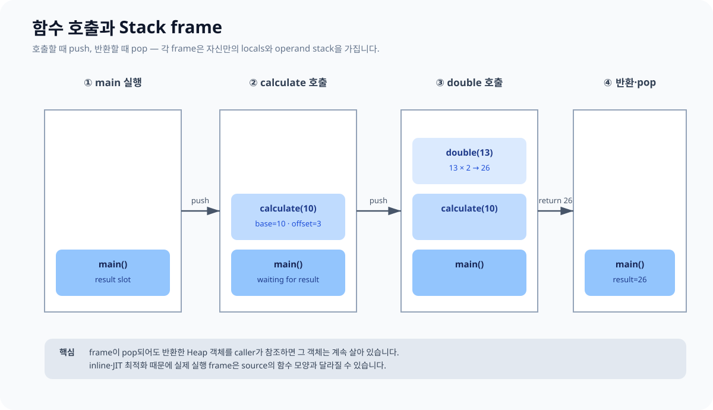

# 03. Stack frame과 함수 호출

각 JVM 스레드는 private JVM Stack을 갖습니다. method를 호출할 때 frame이 생기고, 정상 반환하거나 처리되지 않은 예외로 빠져나오면 해당 frame이 사라집니다.



## frame의 핵심 구성

| 구성 | 역할 |
|---|---|
| Local variable array | parameter, `this`, local value와 reference를 slot 단위로 보관 |
| Operand stack | bytecode 연산의 입력과 중간 결과를 LIFO 형태로 처리 |
| Runtime constant pool reference | 현재 method가 속한 class의 symbol을 동적으로 연결 |
| 반환·예외 처리 정보 | 호출한 frame으로 결과를 돌려주거나 예외를 전파 |

```kotlin
fun double(value: Int): Int = value * 2

fun calculate(base: Int): Int {
    val offset = 3
    return double(base + offset)
}

fun main() {
    val result = calculate(10)
    println(result)
}
```

개념적 호출 순서는 다음과 같습니다.

1. `main` frame 생성: `result`를 위한 local slot이 있음
2. `calculate` 호출: `base=10`, `offset=3`이 해당 frame의 local variable로 존재
3. `double` 호출: `value=13`을 받아 operand stack에서 곱셈
4. `double` frame 제거, `26`을 `calculate`로 반환
5. `calculate` frame 제거, `26`을 `main`으로 반환

## primitive 값과 reference 값

```kotlin
data class Box(var value: Int)

fun mutate(number: Int, box: Box) {
    // number에는 Int 값의 사본이 전달된다.
    // box에는 같은 Box를 가리키는 참조 값의 사본이 전달된다.
    box.value += number
}
```

Kotlin/JVM의 parameter 전달은 값 전달입니다. reference type도 “객체 자체”가 전달되는 것이 아니라 **참조 값이 복사되어 전달**됩니다. 그래서 parameter 변수에 다른 객체를 재할당해도 caller의 변수가 바뀌지 않지만, 같은 객체의 field를 변경하면 caller에서도 보입니다.

## 재귀와 StackOverflowError

```kotlin
fun countdown(value: Int) {
    if (value == 0) return
    countdown(value - 1)
}
```

재귀 호출마다 frame이 추가됩니다. 종료 조건이 없거나 깊이가 지나치면 Stack 용량을 소진해 `StackOverflowError`가 발생할 수 있습니다. Kotlin/JVM의 `tailrec`가 적용 가능한 함수는 compiler가 반복 형태로 바꾸어 frame 증가를 피할 수 있지만, 모든 재귀가 최적화되는 것은 아닙니다.

```kotlin
tailrec fun sumTo(n: Int, acc: Long = 0): Long =
    if (n <= 0) acc else sumTo(n - 1, acc + n)
```

## scope와 frame은 같은 말이 아니다

- scope는 source language에서 이름이 보이는 범위입니다.
- frame은 runtime method invocation 단위입니다.
- inline 함수는 source에 함수 호출처럼 보여도 별도 호출 frame이 생기지 않을 수 있습니다.
- compiler/JIT 최적화 후 실제 기계어 실행은 단순한 그림과 달라질 수 있습니다.

캐치 포인트: “함수 안에서 만들었으니 객체가 Stack에 있다”가 아닙니다. frame의 local variable은 객체를 가리키는 reference를 가질 수 있습니다.

공식 참고: [JVMS §2.6 Frames](https://docs.oracle.com/javase/specs/jvms/se17/html/jvms-2.html#jvms-2.6), [Kotlin tail recursion](https://kotlinlang.org/docs/functions.html#tail-recursive-functions)

다음: [Heap, 객체와 참조](./04_HEAP_REFERENCES.md)
