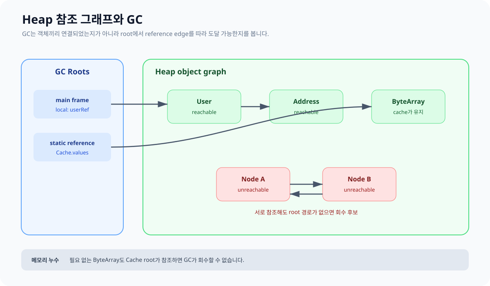

# 05. 객체 수명과 Garbage Collection

JVM에서는 객체를 직접 `free`하지 않습니다. Garbage Collector가 더 이상 필요한 경로가 없는 객체를 찾아 메모리를 재사용합니다. 핵심 판단은 scope 자체보다 **GC root에서 객체까지 도달 가능한가**입니다.



## GC root와 도달 가능성

학습 단계에서는 다음을 주요 root로 생각할 수 있습니다.

- 실행 중인 thread frame의 local reference
- loaded class가 보유한 static field에 대응하는 참조
- JNI 등 native 영역에서 유지하는 참조
- JVM 내부에서 특별히 관리하는 참조

root에서 reference edge를 따라갈 수 있는 객체는 live object로 취급됩니다. 어떤 객체가 다른 객체를 가리키는 순환 구조라도 root에서 도달하지 못하면 회수 후보가 될 수 있습니다.

```kotlin
class Node(val name: String) {
    var next: Node? = null
}

fun createCycle() {
    val a = Node("A")
    val b = Node("B")
    a.next = b
    b.next = a
}
// 함수 종료 후 외부 참조가 없다면 A↔B 순환만으로 살아남지 않는다.
```

## scope 종료와 GC 시점

```kotlin
fun createUser(): User {
    val local = User("Kotlin")
    return local
}
```

`createUser` frame은 반환 시 사라지지만, 반환된 reference가 caller frame으로 전달되므로 `User`는 계속 reachable합니다. 반대로 source scope 안에 이름이 아직 보인다고 실제 기계 코드가 반드시 그 객체를 끝까지 살려 둔다고 단정할 수도 없습니다.

`System.gc()`는 일반적으로 GC 실행 요청이며 즉시 회수나 full GC 완료를 보장하는 계약으로 사용하면 안 됩니다. finalizer에 자원 정리를 맡기지 말고 `use`, `try/finally`, 명시적 lifecycle을 사용합니다.

## 세대별 GC는 구현 전략

HotSpot GC는 많은 객체가 짧게 산다는 관찰을 활용하는 세대별 수집 전략을 사용할 수 있습니다. 다만 Young/Old generation의 정확한 구조와 수집 방식은 collector와 JVM version에 따라 달라집니다. 애플리케이션 의미를 특정 collector 내부 구조에 의존시키지 않습니다.

## 메모리 누수의 JVM식 의미

JVM의 memory leak은 해제 호출을 빼먹는 것보다, 더는 필요하지 않은 객체가 **의도치 않은 참조 때문에 계속 reachable한 상태**인 경우가 많습니다.

```kotlin
object Cache {
    val values = mutableMapOf<String, ByteArray>()
}

fun remember(id: String) {
    Cache.values[id] = ByteArray(1_000_000)
}
```

entry 제거 정책과 크기 상한이 없다면 static root에 해당하는 `Cache`에서 모든 `ByteArray`로 도달할 수 있어 GC가 회수하지 못합니다.

### 자주 남는 참조

- 상한 없는 cache와 collection
- 해제하지 않은 listener·callback
- thread pool thread의 `ThreadLocal`
- 종료되지 않은 thread와 coroutine scope
- 큰 객체 graph를 캡처한 장수 lambda

## OOM과 StackOverflow 구분

| 현상 | 관련 영역 | 먼저 볼 것 |
|---|---|---|
| `StackOverflowError` | 특정 thread의 Stack | 무한/깊은 재귀, 큰 호출 깊이 |
| `OutOfMemoryError: Java heap space` | Heap | live set, allocation rate, heap 상한 |
| `OutOfMemoryError: Metaspace` | HotSpot class metadata | class loader 누수, 동적 class 생성 |
| native thread 생성 실패 | native memory·OS 자원 | thread 수, stack size, OS limit |

캐치 포인트: GC는 “scope가 닫힌 객체”가 아니라 “root에서 도달 불가능한 객체”를 기준으로 이해합니다.

공식 참고: [HotSpot GC tuning guide](https://docs.oracle.com/en/java/javase/17/gctuning/), [JVMS Heap](https://docs.oracle.com/javase/specs/jvms/se17/html/jvms-2.html#jvms-2.5.3)

다음: [스레드와 Java Memory Model](./06_THREADS_AND_MEMORY.md)
